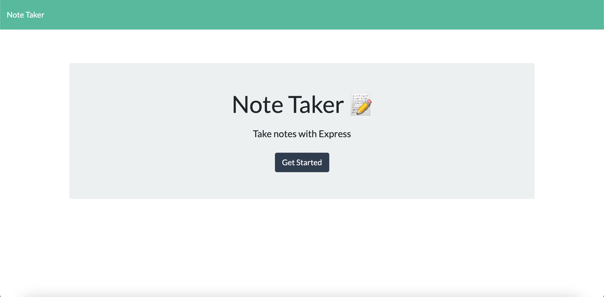
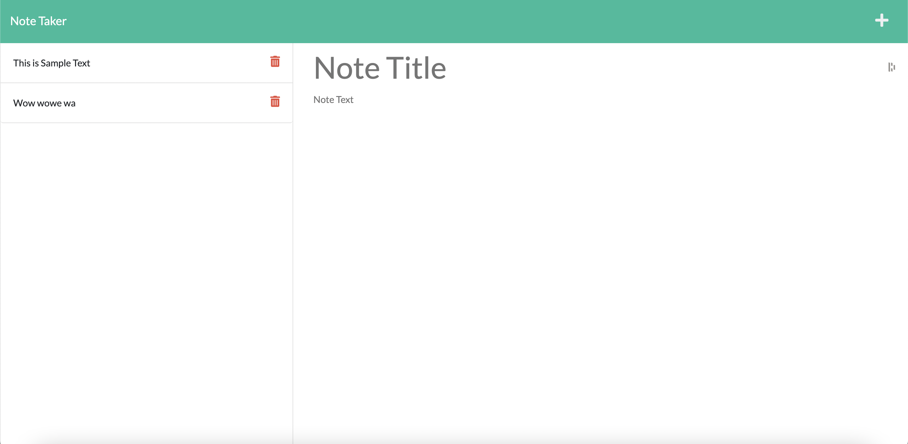
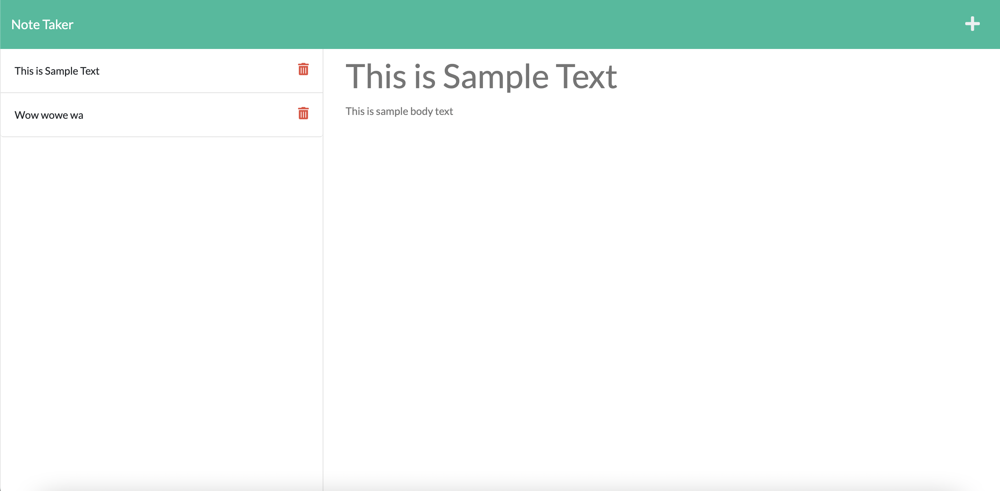

# Note Taker 

## Technology Used 

| Technology Used         | Resource URL           | 
| ------------- |:-------------:| 
| JavaScript | [https://developer.mozilla.org/en-US/docs/Web/JavaScript](https://developer.mozilla.org/en-US/docs/Web/JavaScript)|   
| Git | [https://git-scm.com/](https://git-scm.com/) |
| Node.js | [https://nodejs.org/en](https://nodejs.org/en) |
| Express.js | [https://expressjs.com/](https://expressjs.com/) |
| Heroku | [https://www.heroku.com/?](https://www.heroku.com/?) |

<hr>

## Description 

This project required students to apply user post and get requests to save and view previously created notes. The full project requirements are listed below.

```md
GIVEN a note-taking application
WHEN I open the Note Taker
THEN I am presented with a landing page with a link to a notes page
WHEN I click on the link to the notes page
THEN I am presented with a page with existing notes listed in the left-hand column, plus empty fields to enter a new note title and the note’s text in the right-hand column
WHEN I enter a new note title and the note’s text
THEN a Save icon appears in the navigation at the top of the page
WHEN I click on the Save icon
THEN the new note I have entered is saved and appears in the left-hand column with the other existing notes
WHEN I click on an existing note in the list in the left-hand column
THEN that note appears in the right-hand column
WHEN I click on the Write icon in the navigation at the top of the page
THEN I am presented with empty fields to enter a new note title and the note’s text in the right-hand column
```

<hr>

## Table of Contents

* [Code Sample](#code-sample)
* [Usage](#usage)
* [Learning Points](#learning-points)
* [Author Info](#author-info)

<hr>

## Code Sample

The following code is the default route for the website. A `get` request is made to the root branch upon opening the website. This simply directs the user to the `index.html` file within the `public` directory. Although it is a very simple task, it is an important step to displaying the page and is an important use of get requests.

```js
app.get('/', (req, res) =>
    res.sendFile(path.join(__dirname, './public/index.html'))
);
```

The following is the `javascript` used to save a new post to the page. The function uses the `file system` included with node to take data from the json listed within `./db/db.json` then adds the new note input from within the given field (see Usage) to the array of previously created notes. The previous notes are stored within `parsedData` then the new note is added to it so that the previous notes are not overwritten each time a new note is saved with `writeFile`. 

```js
fs.readFile('./db/db.json', 'utf8', (err, data) => {
    if (err) {
        console.error(err); // log error if error
    } else {
        const parsedData = JSON.parse(data); // parse previous posts 
        parsedData.push(newNote); // add new note to previous (within the js)

        // rewrite the full json file to include new note
        fs.writeFile('./db/db.json', JSON.stringify (parsedData, null, 4), (err) => {
            err ? console.error(err) : console.info(`\nData written to ./db/db.json`)
        }); 
    }
});
```

<hr>

## Usage 

Upon opening the page, the user is presented with a home screen that links to the create notes page.



After clicking the button at the center of the screen titled `Get Started`, the user can then either view previous notes, if they exist, by clicking a previously created notes on the left sidebar. The user can also create a new note by entering text in the text boxes titled `Note Title` and `Note Text`.





<hr>

## Learning Points 

Below are the following topics/methods that I learned through this project:

 * [Node.js](https://nodejs.org/en)
 * [NPM](https://www.npmjs.com/)
 * [Node file system](https://www.w3schools.com/nodejs/nodejs_filesystem.asp)
 * [Express.js](https://expressjs.com/)
 * [Get Statements](https://expressjs.com/en/5x/api.html#app.get)
 * [Post Statements](https://expressjs.com/en/5x/api.html#app.post.method)

<hr>

## Author Info


### Jedd Javier

* [LinkedIn](https://www.linkedin.com/in/jedd-javier-4b323426b/)
* [Github](github.com/jeppjeppjepp0)